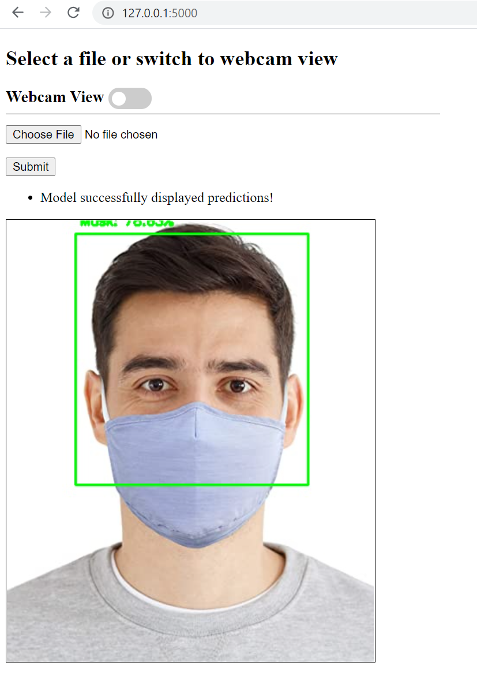

# Face Mask Detector
The code used to warp images of masks onto people's faces for my dataset generateion can be found here:
[DataGenerator](https://github.com/prajnasb/observations/tree/master/mask_classifier/Data_Generator)

I created a Face Mask Detector that puts green boxes around faces that wear masks and red boxes around faces that are not wearing masks. I built this project as it can potentially be used to help ensure the safety of others.

I used Microsoft’s Custom Vision service to label my dataset and train an Tensorflow lite object detection model.
 
The trained model came with a short script to perform basic inference, and I took it a few steps further to develop a webapp with Flask. The web application runs the model through a webcam or an uploaded image and annotes them with the predictions.


## Dependencies
- python 3.7
- Tensorflow 2.1
- In addition, please `pip install -r requirements.txt`
 
## Dataset
I used roughly 2,000 images from CelebA, half wearing fake masks. The fake masks were intelligently edited on top of people’s faces.

 

## Running Mask Detector Web App
1. Change to correct directory:
    ```bash
    cd code/
    ```
2. Run script
    ```bash
     python main.py
    ```
3. Go to http://127.0.0.1:5000/ on your browser, or the available port the script tells you to.
4. Interact with the web app!

 

## Running Mask Detector Script
Alternatively, you can just run the detector through bash instead of a browser. As shown in the first gif above.
1. Change to correct directory:
    ```bash
    cd code/
    ```
2. Run script
    ```bash
     python predict.py [path_to_image]
    ```
    If you do not put a path, the script will automatically turn on your webcam and predict upon those live frames.
## Results on Images
 
